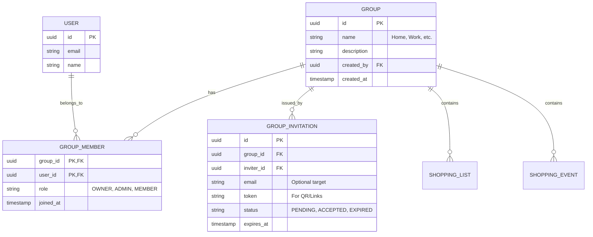

# 01-Flexible Groups & Sharing: Moving Beyond the "Family"

## 1. The "Group" Paradigm
The "Family" concept was too restrictive—users live complex lives. A user might have a "Home" group, a "Work" group, and a "Barbecue with Friends" group. Each group should have its own set of shopping lists and historical events.

## 2. Updated Data Model (Many-to-Many)

## 3. Improved Invitation Flow

### 3.1 QR Code / Deep Link Flow
1.  **Generate**: User clicks "Invite to Group".
2.  **Backend**: Creates a `GROUP_INVITATION` with a unique, cryptographically secure `token`.
3.  **Frontend**: Renders a QR code containing a URL like `https://grocery.app/invite/{token}`.
4.  **Acceptance**: When scanned, the app validates the token and adds the scanning user to the `GROUP_MEMBER` table.

### 3.2 Professional Email Flow
1.  **Send**: User enters an email address.
2.  **Backend**: Sends a styled email with a "Join {Group Name}" button.
3.  **Onboarding**: If the user doesn't have an account, they are prompted to sign up and then automatically added to the group.

## 4. Group-Based Content Organization
- **Shopping Lists**: Instead of a global user list, lists are owned by a `Group`.
- **Shopping Events**: Events are linked to the group that was active when the event started.
- **Privacy**: Only members of "Group A" can see "Group A's" lists and events.

## 5. Architectural Scars (Retail Nexus Veteran Advice)
*   **The "Orphan" User**: What happens if a user leaves all groups?
    *   *Solution*: Every user has a default "Private" group (Self-only) created upon signup. This keeps the data model consistent.
*   **Permission Chaos**: An Admin in Group A shouldn't have powers in Group B.
    *   *Solution*: Always authorize actions based on the `(UserID, GroupID)` tuple in the `GROUP_MEMBER` table.

---
**Status**: DRAFT - *Solutions Architect / Retail Nexus Veteran*
