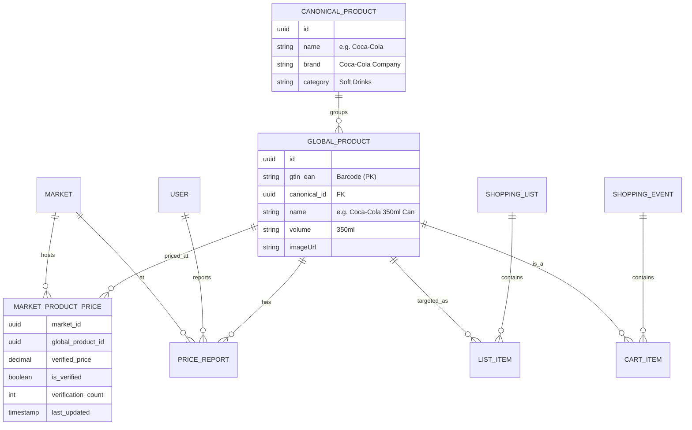

# 01-Architecture Overview: The "Golden Product" Ecosystem

## 1. The Problem Statement
In retail, a "Product" isn't just a name. It's a complex hierarchy of identifiers (GTIN/EAN), variants (Size, Flavor), and price points (Market-specific). Our current system treats products as ephemeral transaction logs. This refactor introduces the **Golden Product**—a canonical, deduplicated, and enriched record that serves as the source of truth for the entire ecosystem.

## 2. Entity Relationship Diagram

## 3. Core Concepts

### 3.1 The Canonical vs Global Distinction
- **Global Product**: A unique SKU identified by a barcode (EAN-13). *Example: Coca-Cola 350ml Can (EAN: 5449000000996)*.
- **Canonical Product (The "Search Group")**: A parent record that groups variants. *Example: "Coca-Cola"*. 
This allows us to answer: *"Where is Coca-Cola cheapest?"* by aggregating across all its EAN variants (Cans, 2L Bottles, etc.) or specifically filtering for the 350ml version.

### 3.2 Crowdsourced Price Consensus
We don't trust a single user report. We use a **N-Factor Consensus Model**.
- **Report**: Any time a user adds an item to a cart, we capture `(UserID, MarketID, EAN, ReportedPrice)`.
- **Verified Price**: When 5 unique users report the same price (+/- a small variance for inflation/promo) within a rolling 7-day window.

### 3.3 Offline-First Resilience
The frontend must be able to scan an EAN and add it to the cart even if the backend or External API is down.
- **Lazy Hydration**: Items added while offline are synced later. If the EAN is unknown, the user provides a temporary name/price, which the backend then attempts to "canonicalize" once online.

---
**Author**: Solutions Architect / Retail Nexus Veteran
**Status**: DRAFT
