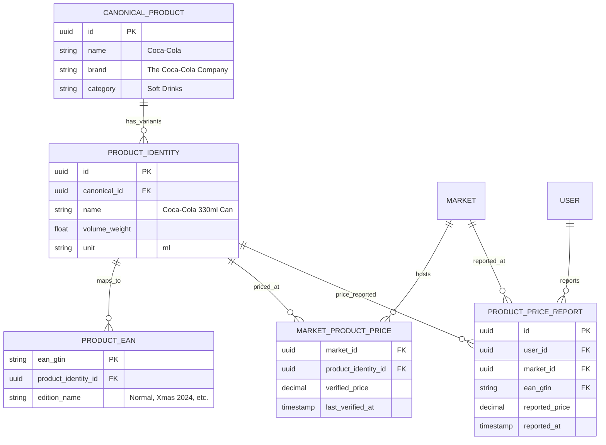

# 01-Data Model & Architecture: The Product Hierarchy

## 1. Introduction
In a high-concurrency retail environment, a "Product" is not a flat entity. A 330ml Coca-Cola Can is different from a 2L Coca-Cola Bottle, but they share the same brand and conceptual identity. This architecture solves the "Duplication vs. Identity" problem by using a three-tier model.

## 2. The Four-Tier Model

1.  **Canonical Product (CP)**: The conceptual entity. 
    *   *Example*: "Coca-Cola Classic".
    *   *Role*: Groups diverse versions (EANs) for search and broad price trends.
2.  **Product Identity (PI) / SKU**: The specific variant and size.
    *   *Example*: "Coca-Cola Classic 330ml Can".
    *   *Role*: THE source of truth for price comparison.
3.  **Physical EAN / GTIN**: The actual barcode on the packaging.
    *   *Example*: EAN-1 (Normal), EAN-2 (Xmas Edition), EAN-3 (Father's Day).
    *   *Role*: Resolves to a Product Identity.
4.  **Market Product Price (MPP)**: The reality at the shelf for that Identity.
    *   *Example*: $1.50 at "Walmart #123" (applicable to all EANs linked to PI).

## 3. Entity Relationship Diagram (ERD)

## 4. Architectural Directives (Retail Nexus Veteran Voice)
*   **No Barcode, No Entry**: Every product entering the "Global" tier MUST have a valid GTIN/EAN. If it doesn't (like loose vegetables), we issue a "Virtual EAN" prefixed with a local namespace to avoid collisions.
*   **Stale Data is Poison**: Prices without updates for >15 days are flagged as "Unverified" and eventually purged or archived.
*   **Identity over String Matching**: We never group products by name. We group by `canonical_id`. Name matching is only for the *Search to Link* phase.

---
**Status**: DRAFT - *Solutions Architect / Retail Nexus Veteran*
