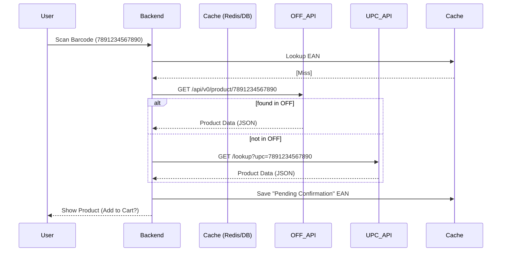

# 02-External API Integration: The Sourcing Strategy

## 1. Primary API Candidates

| API Name            | Coverage      | Cost               | Pros                        | Cons                            |
| :------------------ | :------------ | :----------------- | :-------------------------- | :------------------------------ |
| **Open Food Facts** | Global (Food) | Free               | Open source, huge community | Less coverage for non-food      |
| **UPCitemdb**       | Global (All)  | Tiered (Free/Paid) | Excellent barcode lookup    | Strict rate limits on free tier |
| **Go-UPC**          | Global (All)  | Paid               | High quality metadata       | Costly for small projects       |
| **Barcode Lookup**  | Global (All)  | Paid               | Very high data accuracy     | No free tier worth mentioning   |

### Recommendation: **Hybrid Strategy**
1.  **Open Food Facts (OFF)** as the primary source for food/beverages.
2.  **UPCitemdb** as a fallback for non-food household items.

## 2. Integration Flow (The "Nexus" Pattern)

## 3. Resilience and Failover (Retail Nexus Veteran Advice)
*   **The "Shadow" Cache**: Never make a user wait for an external API during a live shopping event. If the API is slow (>2s), return a "Temporary Product" based on user input and hydrate the metadata asynchronously in the background.
*   **Stale while Revalidate**: If we have the EAN in our cache but it's "old" (>30 days), serve it immediately and trigger a background refresh.
*   **Manual Entry**: If NO API finds the product, allow the user to "Contribute" the product (Photo + Name). This is how we build our own proprietary local database.

## 4. Security & Sensitive Info
*   **API Key Rotation**: Use environment variables and secret management (e.g., Doppler/Vault).
*   **Rate Limit Protection**: Implement a local bucket-refill limiter to ensure we don't get banned/blocked by external providers.

---
**Status**: DRAFT - *Solutions Architect / Retail Nexus Veteran*
