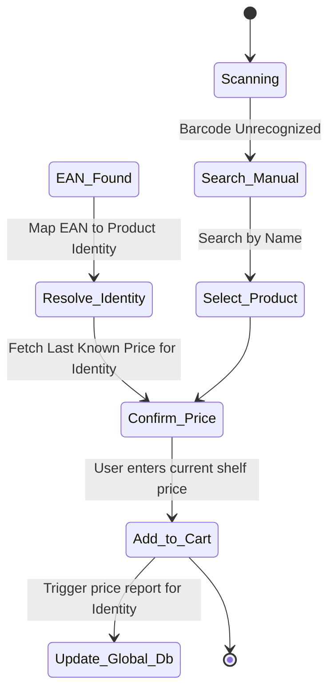

# 04-Shopping Event & Cart: The Lifecycle of a Purchase

## 1. The Interaction Flow
When a user is in a "Shopping Event" (at a specific Market), the cart management system handles both the personal inventory and the global price database.

## 2. Adding a Product to the Cart

## 3. Crowdsourced Pricing Consensus (The "5-User rule")

### 3.1 The Report Lifecycle
1.  **Incoming Report**: User `U1` adds `EAN-X` (Resolved to `Identity-PI`) to cart at `Market-M` for `$2.50`.
2.  **Reputation Check**: If `U1` has a high history of accurate reports, the weight of this report is high.
3.  **Consensus Window**: The system looks for reports of `Identity-PI` at `Market-M` in the last 72 hours.
4.  **Verification**: If 5 unique users with a positive reputation score report `$2.50` (or within a 2% margin), the `MarketProductPrice` for `Identity-PI` at `Market-M` is marked as **Verified**.

## 4. Price History Tracking
Every verified price change is stored in a `price_history` table:
- **Fields**: `market_id`, `ean_gtin`, `price`, `timestamp`, `event_trigger` (Consumer Report, Store Promo, etc.).

## 5. Architectural Scars (Retail Nexus Veteran Advice)
*   **The "Troll" Problem**: Users might report fake prices to mess with the system.
    *   *Solution*: Implement **Outlier Detection**. If a reported price is >30% different from the average of nearby markets, it is flagged and ignored for consensus until manually reviewed or outweighed by more reports.
*   **The "Dynamic Pricing" Hazard**: Some high-end stores change prices based on time of day or loyalty cards.
    *   *Solution*: We capture a `is_on_promotion` flag. Promos are excluded from the "Base Price" calculation for history trends.

---
**Status**: DRAFT - *Solutions Architect / Retail Nexus Veteran*
